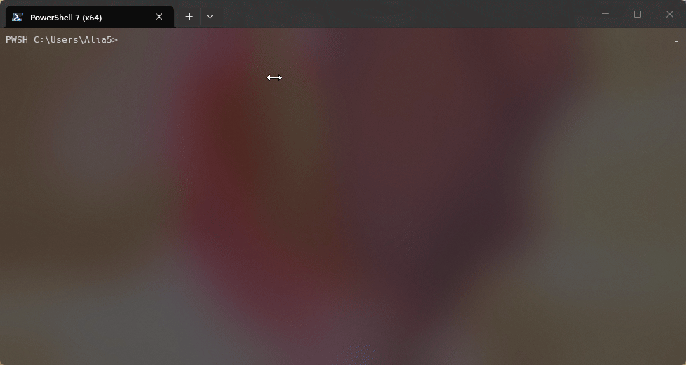
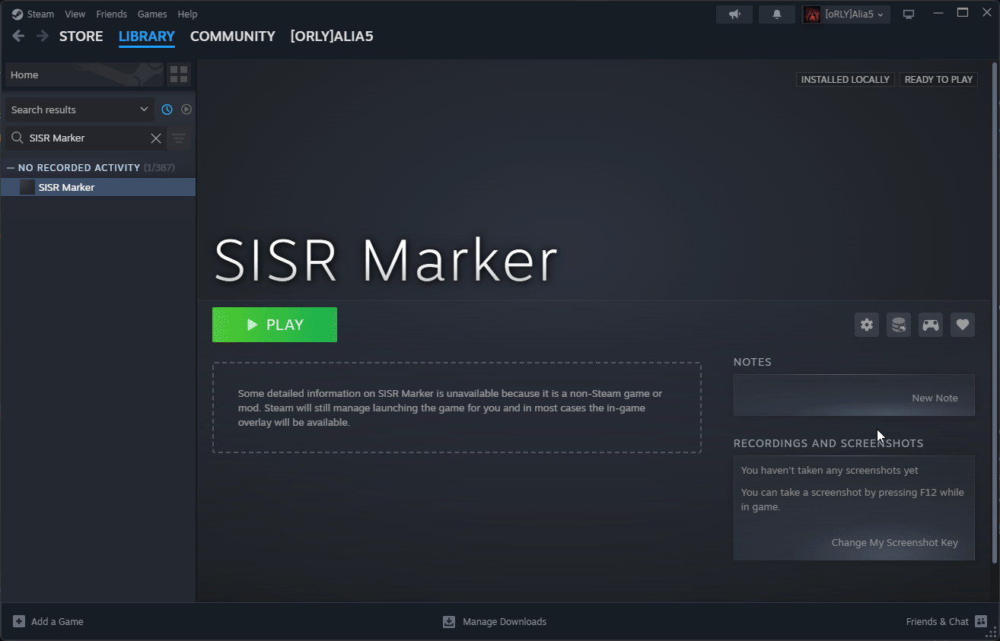
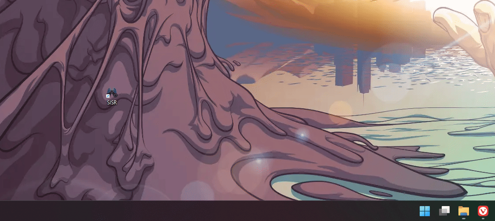

# An introduction to SISR

## Foreword

My little toy project seems to gather a lot more attention than it really deserves, or needs, so it's time for an introduction
and a short explainer of what SISR is, and how to use it.  

Let me preface this by saying that SISR works fine, but it is a **toy project** of mine and a work in progress  
I **do not** consider it good enough for wide usage of the average non-technically inclined user.  
**It is by no means a finished or polished product and it most likely never will be.**  

If you are new to Steam Input in general, I'd urge you to get familiar with Steam Input first,
and only then come back, if SISR is even required at all _(which it most likely isn't)_.  

This introduction is mostly targeted at those who recently got their shiny new Steam Controller 2 and want
to use this software on Windows.  
It is dumbed down to what I would consider the bare minimum a user needs to know before getting started.  

If you are **not** one of those users, check out the rest of the documentation,
you'll most likely find everything you need to know there.  
Or just fuck around and find out.  
<sup>(_**Note**: While linux builds exist, this software is **not** really
useful on Linux, aside from forwarding SteamInput to another machine_)</sup>

## Okay so what is SISR?

SISR is the "Steam Input System Redirector".  
It takes inputs that it receives from Steam Input and simply redirects them.  
That can be either to the same computer, or even another machine across the network.  

In practice this means, that you can use SISR as a tool to _workaround_ having to launch your games through Steam
in order to use Steam Input, which for instance is "required" for the Steam Controller.  

However, the approach of "taking Steam Input inputs and redirecting them" makes SISR rather flexible,
**not specific to any controller**, and allows for different use cases.  
I, for example, have used it in the past to use my Steam Deck as a dedicated controller,
but I imagine this is not why most of you are interested in SISR.  

The approach also means that SISR still requires Steam,
just that you **don't have to launch** your games **through Steam** anymore.  
You **do get** the full functionality of Steam Input, though, like input-remapping, gyro, action-sets,
and all that good stuff.  
<sup>(And yes there is a non-Steam mode, but it is **not** the intended use case and only exists because it is a free side-effect)</sup>

## How to use SISR  

### Installation

[Installation](/getting-started/installation/) is really simple, open up any PowerShell and paste in a single command,
hit enter and it will install itself, VIIPER, a gamepad emulation framework, and the required drivers.  

It is important that you do not skip the installation of the drivers, as they are required for SISR to work.  
Afterwards, it's important that you **reboot your machine**.

```powershell
irm https://alia5.github.io/SISR/stable/install.ps1 | iex
```



If any of the steps fail, check out and follow the [manual installation guide](/getting-started/installation/#manual-installation)

### Initial Setup

After rebooting, you can run SISR from your Desktop or the Start Menu, and it
should automatically detect that this is your first time running the App.  

When you hit "Setup Now" it will do two things:

1. It will restart or start Steam, and while doing so will enable a debug interface in Steam  
   This allows SISR to directly talk to your Steam client
3. It will add an "SISR Marker" shortcut to Steam.  
   This shortcut's Steam Input layout will be used when SISR is run from the Desktop or Start menu,
   as opposed to when running from Steam.  

After this, SISR will restart (or close) and minimize itself to the tray menu.

If this fails, check out and follow the [manual installation guide](/getting-started/installation/#manual-installation)

### Using SISR

#### Running SISR from the Desktop or Start menu

!!! tip inline end "Tray menu"
    

Now, anytime you run SISR from the Desktop or Start menu,
it will show up in the tray menu and
any controllers that you have connected **and** are recognized by Steam,
will show up to your operating system as regular old Xbox360 controllers.  

And even though they show up as Xbox360 controllers, **you will still have all the functionality of Steam Input.**  
**You do not lose any Steam Input features**,
as Steam itself normally does not present any more features to games that are not using the (badly named)
native Steam Input API.

Just open up Steam, go to your Library, find the "SISR Marker" shortcut and edit its Steam Input controller layout.  
Here you can still use trackpads, gyro, and everything else Steam Input has to offer.  



The Steam Input controller layout of the `SISR Marker` essentially acts as a **replacement** of the `Steam Desktop Layout`,
_while SISR is running_ when it is run from the Desktop or Start menu.  

Even touch- and radial-menus work, when the `Enable Steam Overlay` option is enabled from the tray menu,
or SISR's configuration makes this the default (`--w true --f true` flags).



#### Running SISR from Steam

In case you want to have more than a single Steam Input layout, you can also
**run SISR from Steam.**  
You can even add SISR **multiple times** to Steam, and have a different Steam Input layout for each of those shortcuts.

To enable the Steam Overlay, add the flags `--w true --f true` to the launch options of the SISR shortcut in Steam.


### Wrapping up

There's a bit more SISR has to offer, and much more left to actually implement,
but I hope that this gives you enough to get you started.  
Check out the rest of the documentation for more details on usage and configuration,
and if you have any questions or issues, feel free to open a discussion on GitHub
or join on [Discord](https://discord.gg/hs34MtcHJY).  